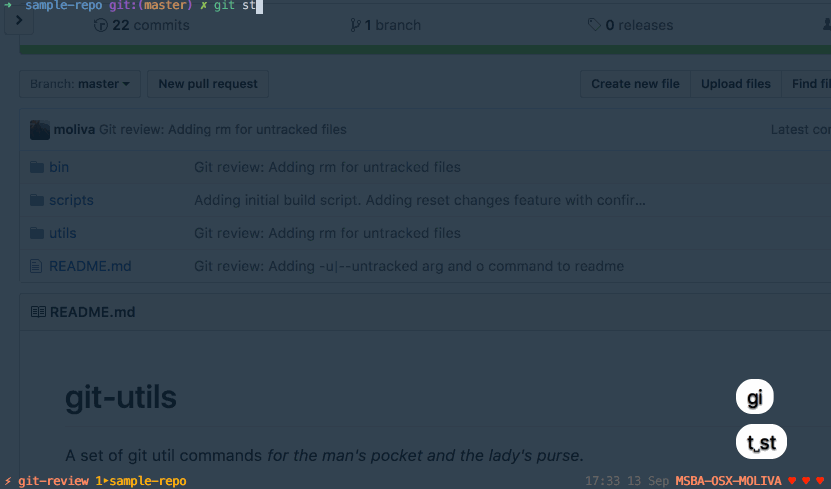

# git-utils
A set of git util commands _for the man's pocket and the lady's purse_.
## Usage

### review



In your local repo just type
```bash
git review # git review -u | --untracked to include untracked files
```
And one by one the diffs will be shown for each tracked file.
Make sure you got everything right for the current file and type either:
* `a` To add the current file to staging area
* `q` To quit the current diff and skip to the next one
* `Q` To quit the current diff and go back to the previous one
* `i` To ignore the remaining files and go back to the command line interface
* `o` To reset changes for the current file

Now everything you've got to do is `commit` and `push` what's already staged. :neckbeard:

## Installation

### Using curl
```bash
sh -c "$(curl -fsSL https://raw.github.com/moliva/git-utils/master/scripts/install.sh)"
```
This will automatically clone this repo into `~/.git-utils` and create a symlink from `/usr/local/bin/git-review`. _Voilà !_
